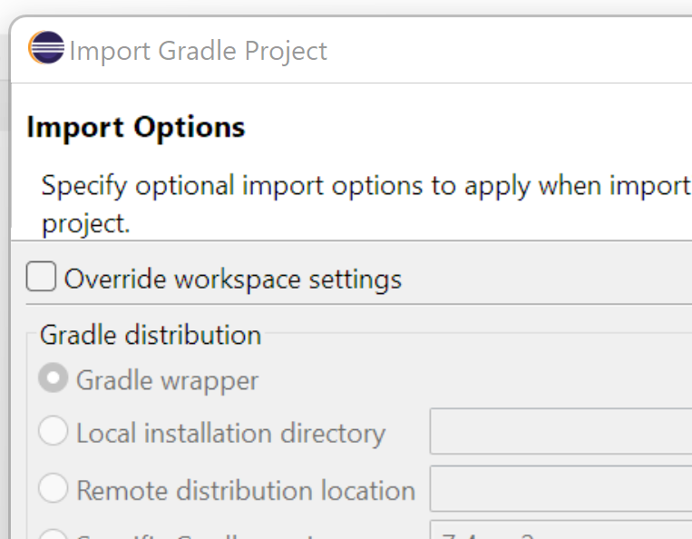

# Eclipse Setup Guide

Importing the project to eclipse is simple, click File->Import, then choose "Existing Gradle Project". 

Next. Next. 

Now choose your server directory as the Project Root directory.

Next.

You should see the Gradle Wrapper selected under **Gradle distribution**.

Next.

You should now see the Gradle version and JDK on the import preview.

Finish.

Wait a bit and that's it.

You may get an error dialog about being unable to configure the Git plugin.  This is because the build.gradle is not in the local repository root.  We have not investigated good solutions to this, but you can click away the dialog, and use git outside of eclipse. Or just mess around in your forked repo to make eclipse happy. 