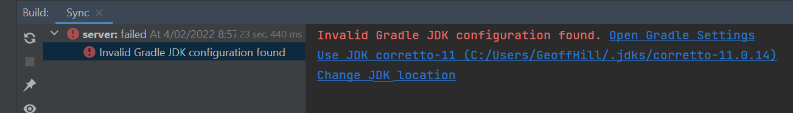
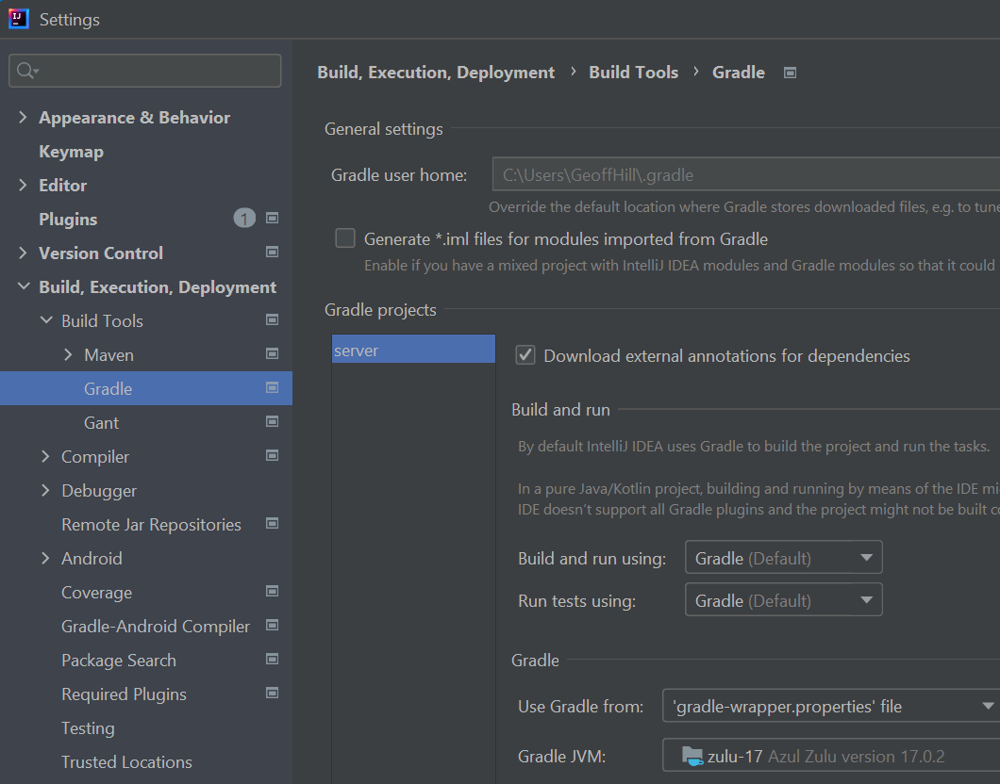
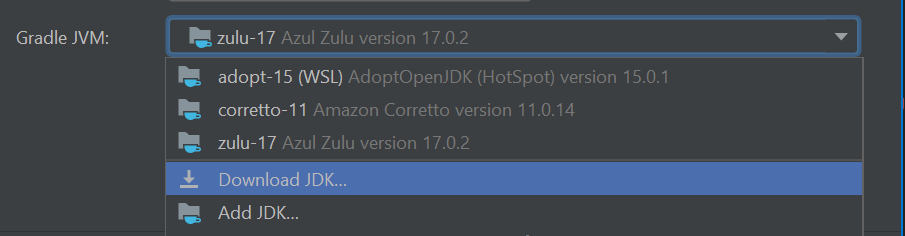
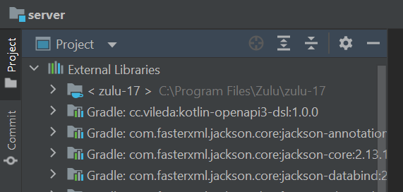
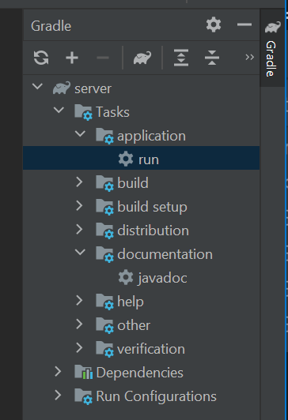
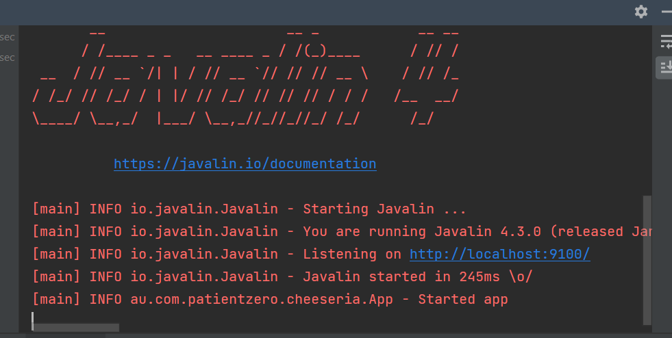

# IntelliJ IDEA Setup Guide

If your terminal install has run successfully, then opening the project in intellij should be as   **File->Open**, and selecting the build.gradle from the server directory. If prompted, choose to treat it as a Project, not just edit the file.

## Setting the JDK manually

If the for whatever reason the JDK17 is not found you will see this problem.

Click on that and you will see this more detailed view.

And if you now click on "Open Gradle Settings", you will get a panel to configure Gradle. Everything can be left at defaults except the Gradle JVM at the bottom.

Select a pre-detected Java 17, or click "DownLoad JDK" to find and install one.

Once you have a JDK17 selected, close the panel with "OK" and then choose **File->Restart IDE** from the top menu. It will restart, open your project, and this time Gradle sync should succeed. You will be able to see this.

Now open up the gradle panel, click "Run" and you are good to go.

