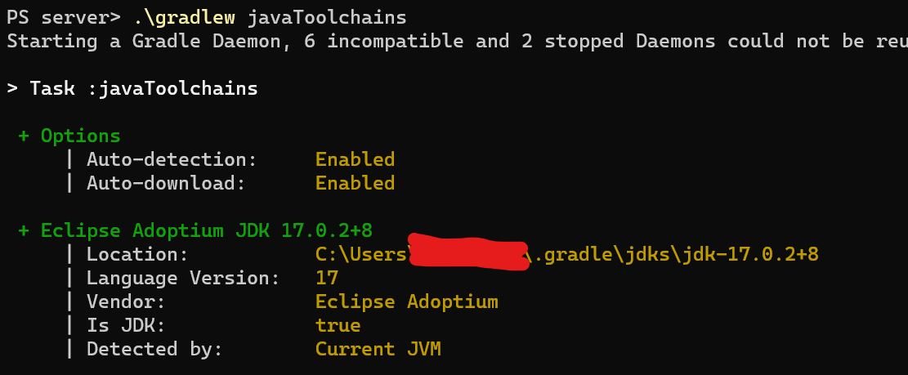
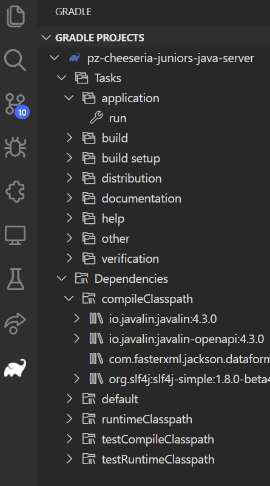

# VSCode Setup Guide

## First, install extensions

To develop the server, we recommend 2 extensions - both from Microsoft:
- Extension Pack for Java 
- Gradle for Java

Now set JAVA_HOME in your user environment variables to the java directory that you get from `.\gradlew javaToolchains`. It should look something like this. This is annoying, as it has the possibility to clash with other applications that use JAVA_HOME, but ifyou don't do it then the gradle plugin is slow, and shows scary error notifications, although it does work.

## Open VSCode

You can now open server folder in VSCode and it will (eventually) be imported as a java project, and your gradle tasks and dependencies will come up when you click the 'Elephant'.

